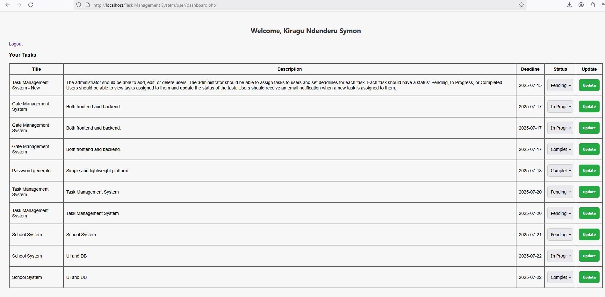

# Task Manager – Documentation

## Overview

This is a **Task Management System** developed using **PHP**, **MySQL**, **CSS** and **HTML**. It allows admins to create, assign, and manage tasks, while users can view and update their task statuses. Email notifications are sent using **PHPMailer** when tasks are assigned.

## Login Credentials

**Admin**

   - Username / Email: sykig04@gmail.com

   - Password: 12345678

**Users**

   - Admin can create new users manually via the Add User panel.

   - Each user has a unique name, email, and role set during creation.

## Project Structure
```
/task-manager/
/task-manager/
│
├── config/
│   └── db.php               # DB connection setup
│
├── admin/
│   ├── dashboard.php        # Admin control panel
│   ├── add_user.php         # Create user
│   ├── edit_user.php        # Edit user info
│   ├── delete_user.php      # Delete user
│   ├── assign_task.php      # Assign new tasks
│   ├── tasks.php            # Admin view: All tasks
│
├── user/
│   └── dashboard.php        # User's task dashboard
│
├── includes/
│   ├── functions.php        # Input sanitization, helper code
│   ├── auth.php             # Session auth check
│   └── mail.php             # PHPMailer integration
│
├── style.css                # Global styling
├── login.php                # Login page
├── logout.php               # Logout script
├── index.php                # Welcome page
│
├── sql/
│   └── task_manager.sql     # MySQL dump file

```
# Dependencies

- PHP 7.4 or higher
- MySQL 5.7 or higher
- PHPMailer (https://github.com/PHPMailer/PHPMailer)

##  Features

### Admin
- Add/edit/delete users
- Assign tasks to users (only users, not admins)
- Set deadlines for the tasks
- View all tasks with assigned user, deadline, and status
- Update task statuses
- Automatic email notifications on task assignment

### Users
- View their assigned tasks
- Update task statuses (Pending, In Progress, Completed)

### Common
- Login/logout for both roles
- Simple responsive UI using CSS
- Input validation and session control

---
## Screenshots

###  Login Page


### Admin Dashboard


### Assign Task Interface


### Assigned Task notification alert


###  User Task View


###  User Email notification View


## Email Notifications with PHPMailer

I used **PHPMailer** to send task assignment notifications. 
### Setup PHPMailer

1. Download PHPMailer:  
   [https://github.com/PHPMailer/PHPMailer](https://github.com/PHPMailer/PHPMailer)

2. Extract and place the `src/` folder inside `/includes/` or `/vendor/` folder in your project.
   Include it in `mail.php` like:


3. Update `includes/mail.php` like this:

```php
use PHPMailer\PHPMailer\PHPMailer;
use PHPMailer\PHPMailer\Exception;
require 'phpmailer/PHPMailer.php';
require 'phpmailer/SMTP.php';
require 'phpmailer/Exception.php';

function sendTaskEmail($to, $subject, $body) {
    $mail = new PHPMailer(true);
    try {
        $mail->isSMTP();
        $mail->Host       = 'smtp.gmail.com'; // Your SMTP
        $mail->SMTPAuth   = true;
        $mail->Username   = 'your-email@gmail.com';
        $mail->Password   = 'your-email-password';
        $mail->SMTPSecure = 'tls';
        $mail->Port       = 587;

        $mail->setFrom('your-email@gmail.com', 'Task Manager');
        $mail->addAddress($to);
        $mail->isHTML(true);
        $mail->Subject = $subject;
        $mail->Body    = $body;

        $mail->send();
    } catch (Exception $e) {
        error_log("Message could not be sent. Mailer Error: {$mail->ErrorInfo}");
    }
}
```

## Database Setup

Import the provided SQL dump sql/task_manager.sql for both tasks and users into your MySQL database.

**Main Tables:**

   - users(id, name, email, username, password, role)

 - tasks(id, user_id, title, description, deadline, status)
   
**Reference:** 
- PHPMailer Documentation
   
   
